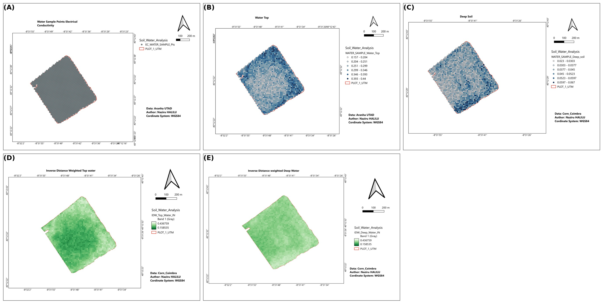
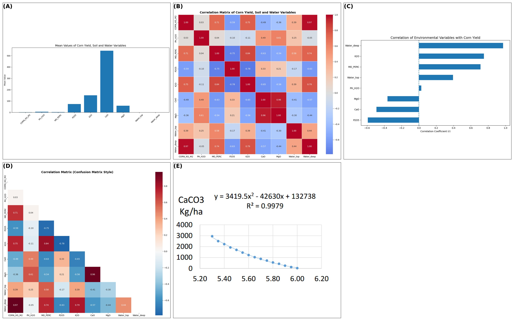
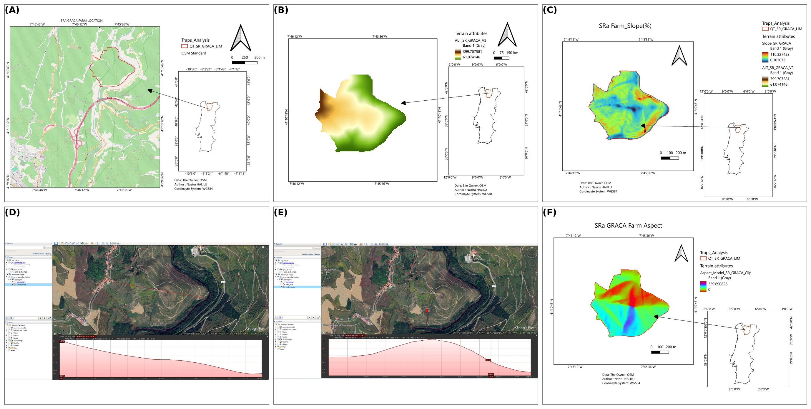
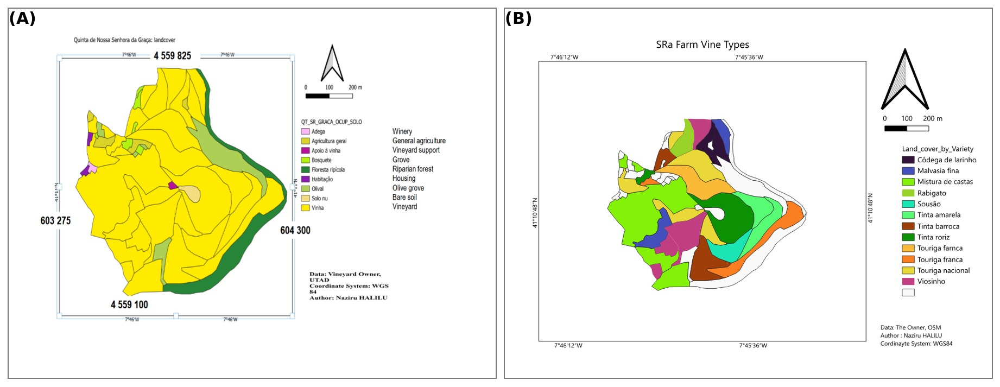
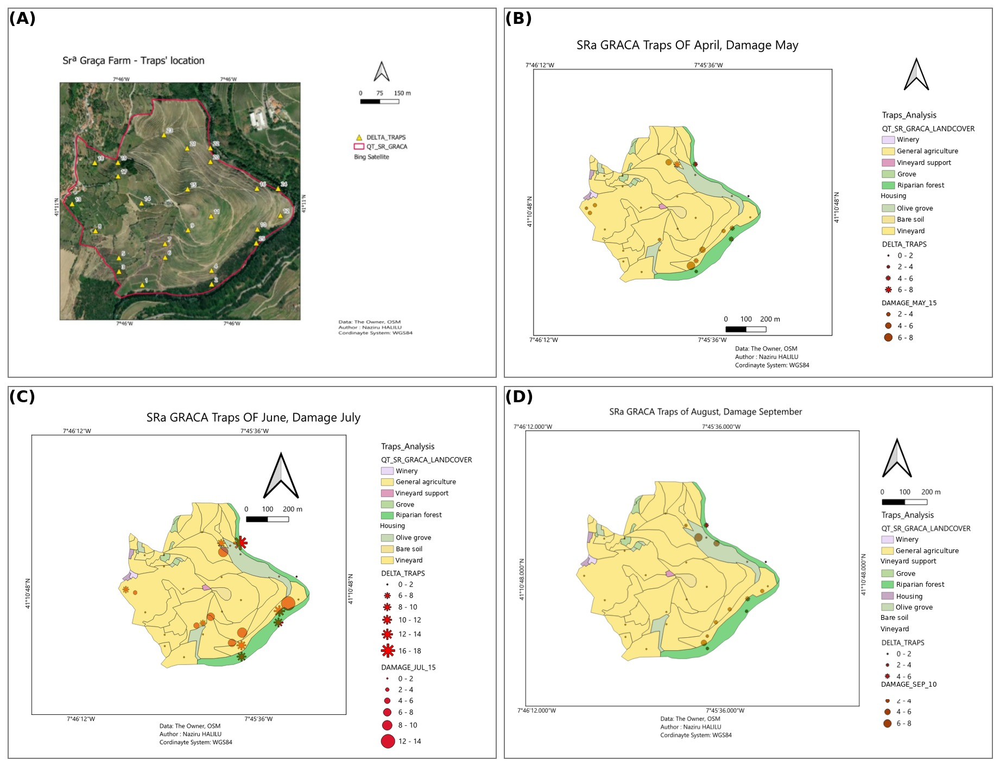
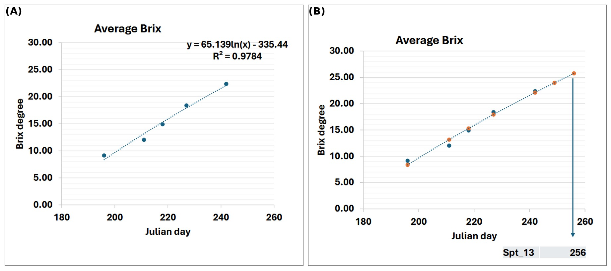
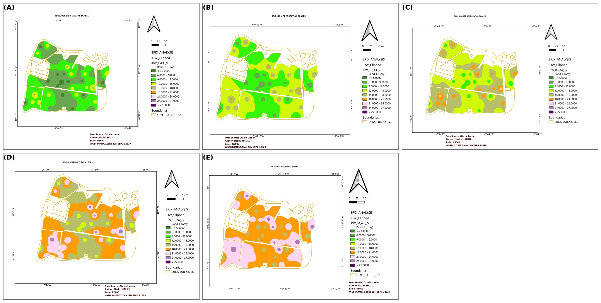
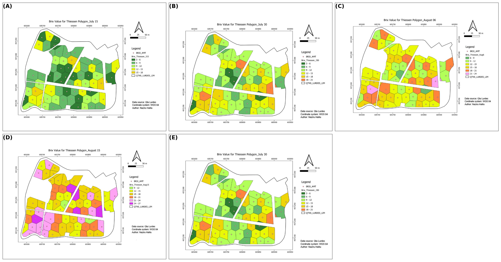
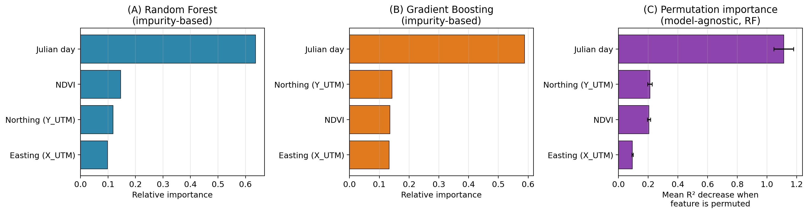
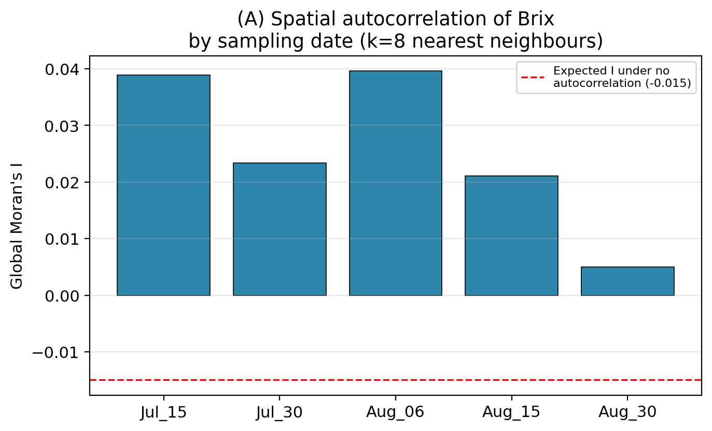

# Operationalizing GIS and Machine Learning across Contrasting Cropping Systems

**Author:** Naziru Halilu

This repository accompanies the manuscript **"Integrated GIS, Remote-Sensing, and
Machine-Learning Precision Agriculture Across Three Portuguese Cropping Systems:
Maize Fertility Zoning, Vineyard Pest Monitoring, and Machine-Learning-Enhanced
Grape Ripening Prediction."**

## Figures

All 21 manuscript figures, grouped by case study. Each panel is labelled
(A)(B)(C)... in plain black text.

### 1. Maize Fertility Zoning


**Figure 10** — Study area


**Figure 11** — Soil maps


**Figure 12** — NDVI


**Figure 13** — Water and irrigation


**Figure 14** — Statistical summary


**Figure 15** — Model performance


**Figure 16** — Variable-rate technology (VRT) prescription map

### 2. Vineyard Pest Monitoring


**Figure 17** — Terrain


**Figure 18** — Land use


**Figure 18C** — Pest monitoring (trap locations)

### 3. Grape Ripening / Brix Prediction


**Figure 1** — Study site


**Figure 2** — Regression


**Figure 3** — Brix sampling


**Figure 4** — Experimental design


**Figure 5** — Thiessen polygons


**Figure 6** — Remote sensing

### 4. Machine-Learning Results


**Figure 17** — Model comparison (cross-validated RMSE/MAE/R²)


**Figure 18** — Feature and permutation importance


**Figure 19** — Observed vs. predicted


**Figure 20** — Hybrid regression-kriging surface map


**Figure 21** — Moran's I spatial autocorrelation

---

## Repository structure

```
manuscript/   The final manuscript (.docx, 30 pages), with all in-text citations
              hyperlinked to bookmarked reference-list entries (28 references),
              20 numbered equations covering IDW, NDVI, Pearson correlation,
              quadratic regression, Random Forest, Gradient Boosting, a
              Multi-Layer Perceptron, a Stacking Ensemble, regression-kriging
              (variogram + kriging system), Moran's I, and RMSE/MAE/R², plus a
              Nomenclature table and 21 figures.

code/         All Python source code used in this project:
                - train_regression_kriging.py : trains and cross-validates IDW,
                  Random Forest, Gradient Boosting, a Neural Network (MLP), a
                  Stacking Ensemble, and hybrid regression-kriging (RF-RK,
                  GB-RK) models for Brix prediction; also computes Moran's I
                  and permutation importance.
                - make_ml_figures.py           : generates the model-comparison,
                  feature-importance, Moran's I, and observed-vs-predicted
                  figures (Figures 17–19).
                - make_hybrid_map.py           : generates the spatial hybrid
                  regression-kriging surface map (Figure 20).
                - make_grid.py                 : builds the labelled A/B/C...
                  figure grids from the field-photo/GIS-map source images.
                - translate_legend.py          : translates the Portuguese GIS
                  legend text in the vineyard-pest trap figures into English.

data/         The field data used to train the machine-learning models:
                - BRIX_AMT.csv          : 68 georeferenced (UTM) sampling points,
                  Brix at 5 dates (15 Jul – 30 Aug).
                - Sample_brix_ndvi.xlsx : same points with paired NDVI values.
                - BRIX_AMT_V2.xlsx      : original source workbook.

results/      Model outputs:
                - merged_brix_ndvi_utm.csv       : the cleaned, merged analysis
                  dataset.
                - cv_pooled_spatiotemporal.json  : cross-validated RMSE/MAE/R²
                  for IDW, Random Forest, Gradient Boosting, Neural Network,
                  Stacking Ensemble, RF-RK, and GB-RK (pooled spatio-temporal,
                  GroupKFold-by-location design; corresponds to Table 3 in the
                  manuscript).
                - cv_model_comparison.json       : per-date, spatial-only
                  cross-validation results.
                - morans_i_brix.json             : global Moran's I
                  spatial-autocorrelation statistic for Brix at each sampling
                  date (Figure 21).
                - permutation_importance.json    : permutation importance for
                  Easting, Northing, Julian day, and NDVI (Figure 18).

figures/      All 21 manuscript figure images (JPEG): the 5 machine-learning
              figures (ml_grid1–5) and the 16 case-study figure grids (corn_*,
              gm_*, bx_*), each labelled with plain (A)(B)(C)... panel letters.
```

## How to reproduce the machine-learning analysis

Requirements: Python 3, `pandas`, `numpy`, `scipy`, `scikit-learn`, `matplotlib`.
`scikit-learn`'s `GradientBoostingRegressor` is used to implement the
gradient-boosted decision-tree models.

```bash
cd code
python3 train_regression_kriging.py   # trains models, cross-validates, writes results/
python3 make_ml_figures.py            # writes figures/ml_grid1-3
python3 make_hybrid_map.py            # writes figures/ml_grid4 (spatial surface map)
```

## Results summary

Under spatially grouped cross-validation (each vineyard sampling location held
out in full, across all five dates), Random Forest, Gradient Boosting, a Neural
Network (MLP), a Stacking Ensemble, and hybrid regression-kriging do not
outperform simple IDW interpolation for Brix prediction at the sampling density
available (68 points): cross-validated R² is 0.538 (IDW), 0.520 (Random Forest),
0.453 (Gradient Boosting), 0.370 (Neural Network), 0.467 (Stacking Ensemble), and
0.378–0.454 (regression-kriging variants). Two diagnostics explain this result:
permutation importance shows Julian day dominates NDVI and spatial coordinates by
roughly 5:1, and the global Moran's I statistic shows only weak spatial
autocorrelation in raw Brix values (I = 0.005–0.040 against an expected −0.015
under complete spatial randomness) — indicating limited spatially structured
residual signal for regression-kriging to exploit once the temporal trend is
removed. The pipeline is a reusable methodological contribution expected to show
clearer benefits on denser, multi-covariate, and/or multi-season datasets, with
the maize case study identified as the leading candidate for this extension (see
manuscript Sections 4.1 and 4.3).

## Data provenance

All data in `data/` were collected from original field campaigns conducted as
part of UTAD coursework (Quinta de Nossa Senhora de Lurdes, Vila Real,
Portugal). All cross-validation results in `results/` were computed directly
from this dataset.

## License

Released under the [MIT License](./LICENSE).
