# Operationalizing GIS and Machine Learning across Contrasting Cropping Systems

[](./LICENSE) 
[](https://doi.org/10.5281/zenodo.21760034)

**Author:** Naziru Halilu

This repository accompanies the manuscript **"Integrated GIS, Remote-Sensing, and
Machine-Learning Precision Agriculture Across Three Portuguese Cropping Systems:
Maize Fertility Zoning, Vineyard Pest Monitoring, and Machine-Learning-Enhanced
Grape Ripening Prediction."**


## Problem, Methodology, and Results

**Workflow sketch**

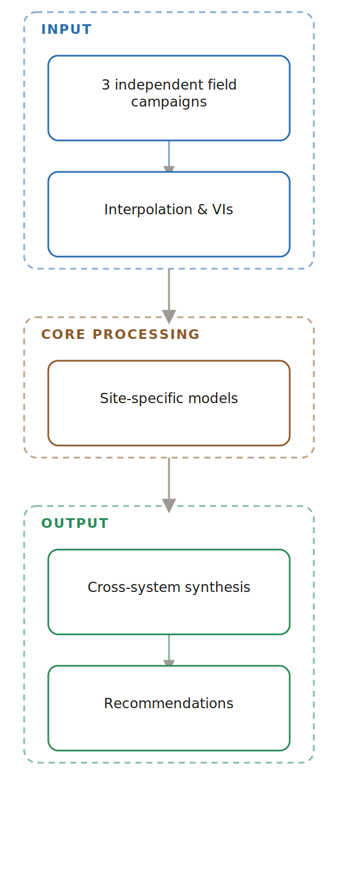

[View interactive graphical abstract →](https://halilunaziru73-creator.github.io/Operationalizing-GIS-and-Machine-Learning-across-Contrasting-Cropping-Systems/)

**Problem.** Farm-scale precision-agriculture case studies are common in training and consultancy settings but are rarely synthesised into a single comparative analysis across contrasting cropping systems.

**Methodology.** Three independent GIS and remote-sensing field campaigns in northern and central Portugal were integrated into one comparative framework: (i) spatial fertility mapping and variable-rate prescription for a maize field in Coimbra (16.85 ha); (ii) GIS-based monitoring of the European grapevine moth across three generations at Quinta da Senhora da Graça, Douro (42.97 ha); and (iii) Brix-based ripening and harvest-date prediction integrated with NDVI monitoring at Quinta de Nossa Senhora de Lurdes, Vila Real (6 ha). Inverse Distance Weighting, Thiessen/Voronoi tessellation, and multispectral vegetation indices converted point-sampled measurements into continuous management surfaces.

**Results.** In the maize system, yield correlated strongly with deep soil-water content (r = 0.972) and potassium oxide (r = 0.751); a quadratic yield–fertiliser regression (R² = 0.995) supported a variable-rate NPK/liming programme that cut total lime demand by 2.69 t versus uniform application. In the vineyard pest system, pheromone-trap captures showed a consistent three-generation spatial pattern, with a second-generation surge (trap counts 16–18) driving the principal within-season damage peak. In the ripening system, a logarithmic Brix–Julian-day regression (R² = 0.978) forecast harvest maturity (25.5–27 °Bx) around 13 September, and an NDVI–Brix regression explained 88% of variance (R² = 0.880).

## Table of Contents

- [Figures](#figures)
- [Repository structure](#repository-structure)
- [How to Run the Code](#how-to-run-the-code)
- [Results summary](#results-summary)
- [Data provenance](#data-provenance)
- [License](#license)
- [Citation](#citation)
- [Related work](#related-work)

## Figures

All 21 manuscript figures, extracted directly from the manuscript and presented
in their original figure order:

### Maize Fertility Zoning (Coimbra)

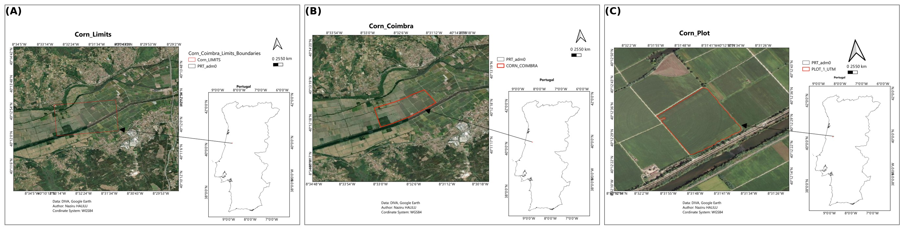
**Figure 1** — Study-area delineation for the Coimbra maize field.

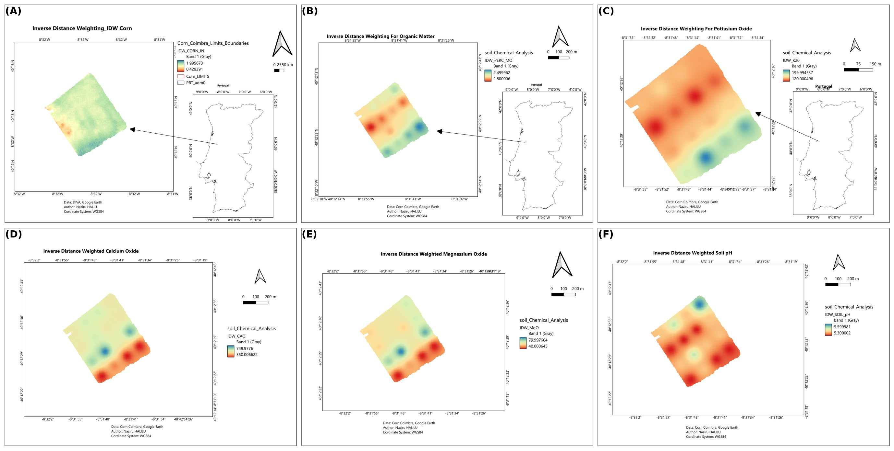
**Figure 2** — Inverse-distance-weighted interpolation surfaces.

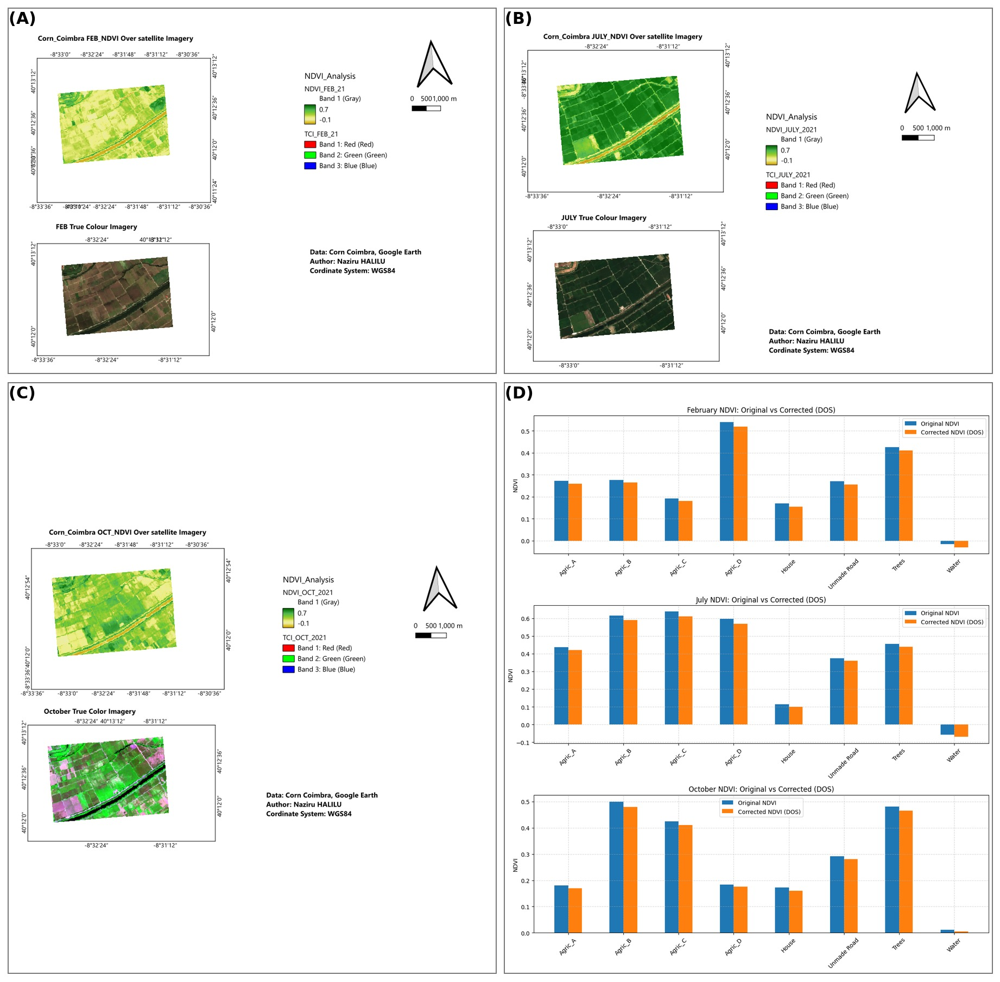
**Figure 3** — Temporal NDVI dynamics across the growing season.


**Figure 4** — Water sampling design and interpolated surfaces.

### Vineyard Pest Monitoring (Quinta da Senhora da Graça)


**Figure 5** — Terrain characterisation of the study vineyard.


**Figure 6** — Land-use and varietal composition.


**Figure 7** — Pheromone trap network and spatio-temporal pest dynamics.

### Grape Ripening / Brix Prediction (Quinta de Nossa Senhora de Lurdes)

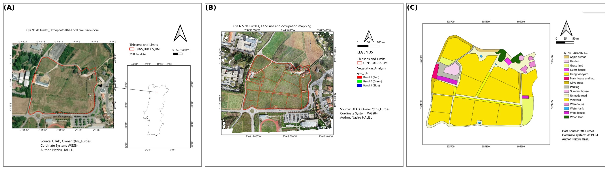
**Figure 8** — Study-site characterisation.


**Figure 9** — Regression-based ripening forecast.

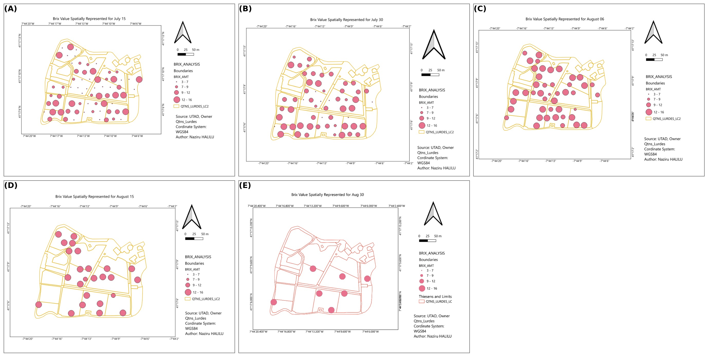
**Figure 10** — Spatially interpolated Brix values from traditional field
sampling.


**Figure 11** — Spatially interpolated Brix values from the UTAD Enology
experimental plots.


**Figure 12** — Brix values partitioned by Thiessen/Voronoi polygons.

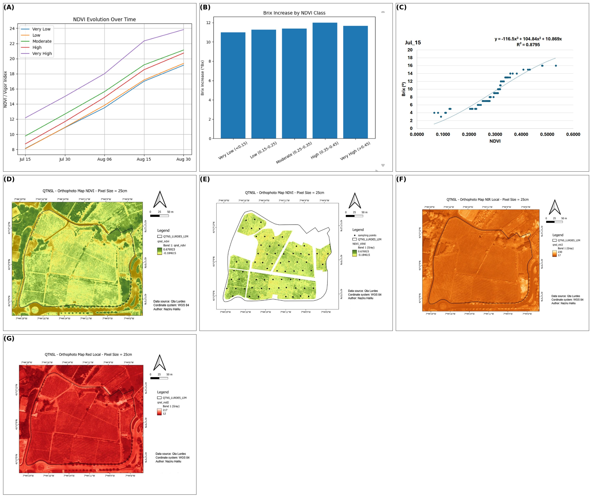
**Figure 13** — Regression diagnostics and remote-sensing products for ripening
prediction.

### Maize Fertility Zoning — Model Outputs


**Figure 14** — Descriptive and correlation analysis for the Coimbra maize
field.

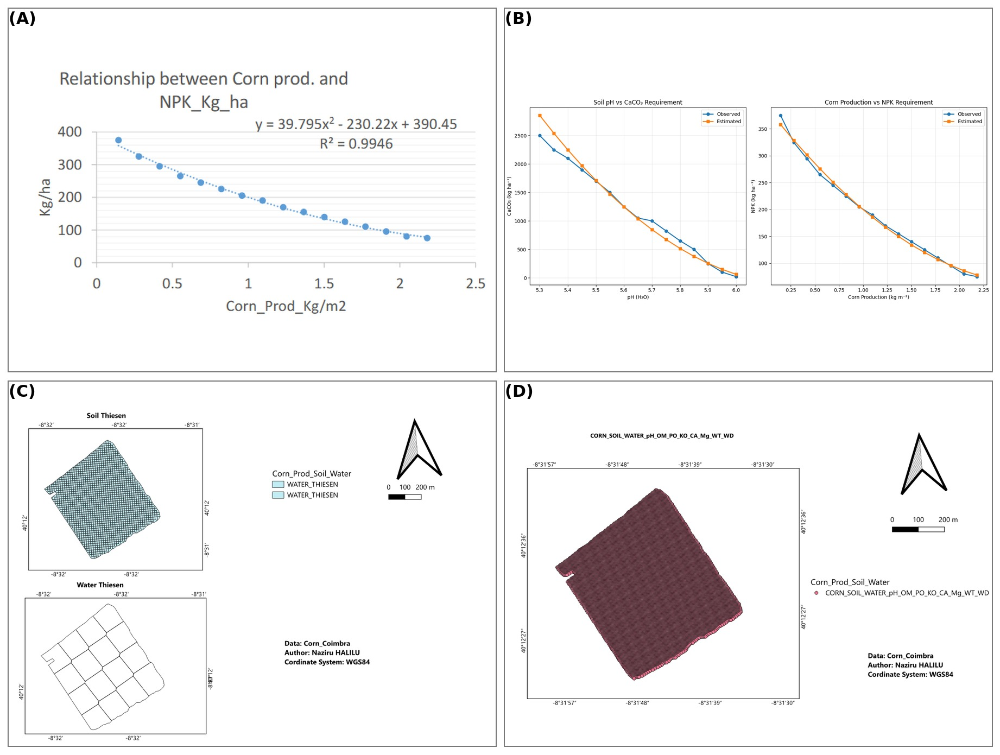
**Figure 15** — Model performance and zonation outputs.

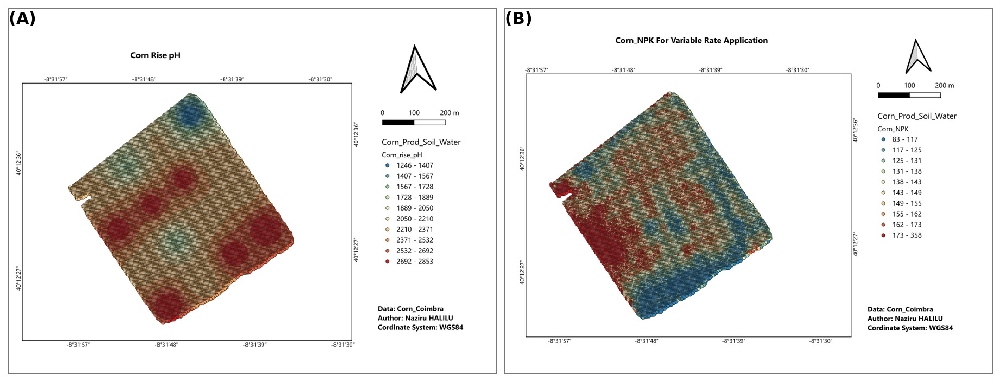
**Figure 16** — Variable-rate prescription maps.

### Machine-Learning Results (Grape Ripening)

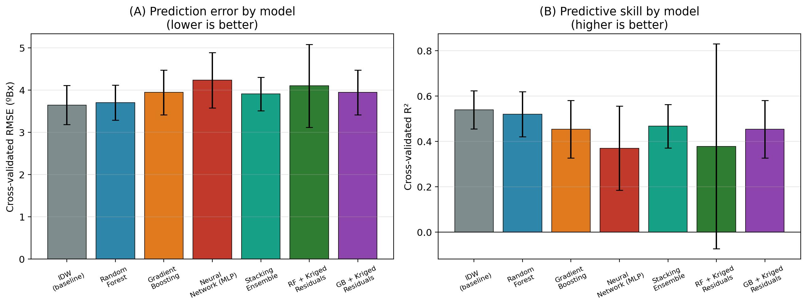
**Figure 17** — Cross-validated model comparison for Brix prediction across
seven models.


**Figure 18** — Feature importance for Brix prediction.


**Figure 19** — Global Moran's I spatial autocorrelation of raw Brix values.

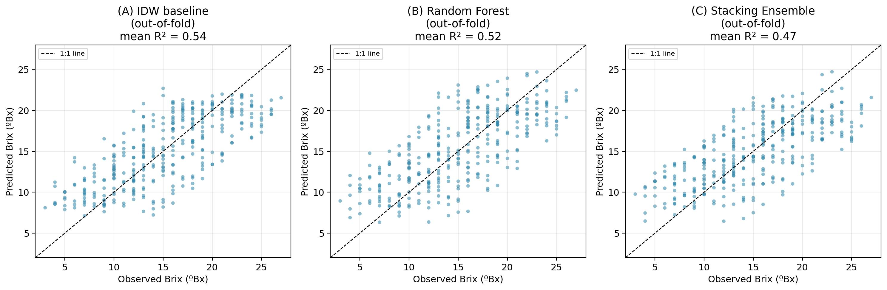
**Figure 20** — Out-of-fold observed-versus-predicted Brix values.

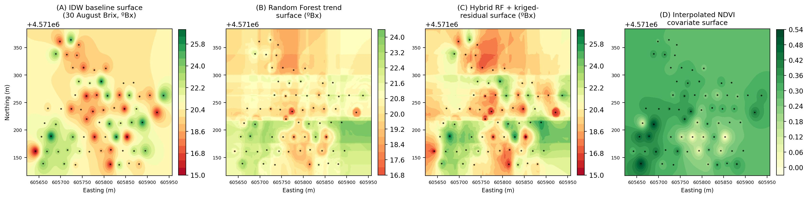
**Figure 21** — Spatial interpolation surfaces for 30 August Brix.

---

## Repository structure

```
manuscript/   The final manuscript (.docx, 30 pages), with all in-text citations
              hyperlinked to bookmarked reference-list entries (28 references),
              20 numbered equations covering IDW, NDVI, Pearson correlation,
              quadratic regression, Random Forest, Gradient Boosting, a
              Multi-Layer Perceptron, a Stacking Ensemble, regression-kriging
              (variogram + kriging system), Moran's I, and RMSE/MAE/R², plus a
              Nomenclature table and 21 figures.

code/         All Python source code used in this project:
                - train_regression_kriging.py : trains and cross-validates IDW,
                  Random Forest, Gradient Boosting, a Neural Network (MLP), a
                  Stacking Ensemble, and hybrid regression-kriging (RF-RK,
                  GB-RK) models for Brix prediction; also computes Moran's I
                  and permutation importance.
                - make_ml_figures.py           : generates the model-comparison,
                  feature-importance, Moran's I, and observed-vs-predicted
                  analysis charts.
                - make_hybrid_map.py           : generates the spatial hybrid
                  regression-kriging surface map.
                - make_grid.py                 : builds the labelled A/B/C...
                  figure grids from the field-photo/GIS-map source images.
                - translate_legend.py          : translates the Portuguese GIS
                  legend text in the vineyard-pest trap figures into English.

data/         The field data used to train the machine-learning models:
                - BRIX_AMT.csv          : 68 georeferenced (UTM) sampling points,
                  Brix at 5 dates (15 Jul – 30 Aug).
                - Sample_brix_ndvi.xlsx : same points with paired NDVI values.
                - BRIX_AMT_V2.xlsx      : original source workbook.

results/      Model outputs:
                - merged_brix_ndvi_utm.csv       : the cleaned, merged analysis
                  dataset.
                - cv_pooled_spatiotemporal.json  : cross-validated RMSE/MAE/R²
                  for IDW, Random Forest, Gradient Boosting, Neural Network,
                  Stacking Ensemble, RF-RK, and GB-RK (pooled spatio-temporal,
                  GroupKFold-by-location design; corresponds to Table 3 in the
                  manuscript).
                - cv_model_comparison.json       : per-date, spatial-only
                  cross-validation results.
                - morans_i_brix.json             : global Moran's I
                  spatial-autocorrelation statistic for Brix at each sampling
                  date (Figure 19).
                - permutation_importance.json    : permutation importance for
                  Easting, Northing, Julian day, and NDVI (Figure 18).

figures/      All 21 manuscript figures, extracted directly from the
              manuscript, in original figure order (Figure_01–Figure_21).
```

## How to Run the Code

### 1. Clone the repository

```bash
git clone https://github.com/halilunaziru73-creator/Operationalizing-GIS-and-Machine-Learning-across-Contrasting-Cropping-Systems.git
cd Operationalizing-GIS-and-Machine-Learning-across-Contrasting-Cropping-Systems
```

### 2. Install dependencies

Requirements: Python 3, `pandas`, `numpy`, `scipy`, `scikit-learn`, `matplotlib`.
`scikit-learn`'s `GradientBoostingRegressor` is used to implement the
gradient-boosted decision-tree models.

```bash
pip install pandas numpy scipy scikit-learn matplotlib
```

### 3. Reproduce the machine-learning analysis

```bash
cd code
python3 train_regression_kriging.py   # trains models, cross-validates, writes results/
python3 make_ml_figures.py            # writes machine-learning analysis charts
python3 make_hybrid_map.py            # writes the spatial hybrid surface map
```

## Results summary

Under spatially grouped cross-validation (each vineyard sampling location held
out in full, across all five dates), Random Forest, Gradient Boosting, a Neural
Network (MLP), a Stacking Ensemble, and hybrid regression-kriging do not
outperform simple IDW interpolation for Brix prediction at the sampling density
available (68 points): cross-validated R² is 0.538 (IDW), 0.520 (Random Forest),
0.453 (Gradient Boosting), 0.370 (Neural Network), 0.467 (Stacking Ensemble), and
0.378–0.454 (regression-kriging variants). Two diagnostics explain this result:
permutation importance shows Julian day dominates NDVI and spatial coordinates by
roughly 5:1, and the global Moran's I statistic shows only weak spatial
autocorrelation in raw Brix values (I = 0.005–0.040 against an expected −0.015
under complete spatial randomness) — indicating limited spatially structured
residual signal for regression-kriging to exploit once the temporal trend is
removed. The pipeline is a reusable methodological contribution expected to show
clearer benefits on denser, multi-covariate, and/or multi-season datasets, with
the maize case study identified as the leading candidate for this extension (see
manuscript Sections 4.1 and 4.3).

## Data provenance

All data in `data/` were collected from original field campaigns conducted as
part of UTAD coursework (Quinta de Nossa Senhora de Lurdes, Vila Real,
Portugal). All cross-validation results in `results/` were computed directly
from this dataset.

## License

Released under the [MIT License](./LICENSE).

## Citation

If you use this repository, please cite it using the metadata in
[`CITATION.cff`](./CITATION.cff) (GitHub renders a "Cite this repository"
button on the repo's main page, in the top-right "About" panel).

## Related work

Part of a broader body of research on GIS, remote sensing, and machine
learning for agronomic and environmental applications:

- [Digital Twin for Gully Biocontrol](https://github.com/halilunaziru73-creator/Digital-Twin-for-the-Evaluation-of-Experimental-Gully-Biocontrol-Using-Morning-Glory-Ipomoea-spp)
- [Geometry-Agnostic Contrastive Learning (GACL)](https://github.com/halilunaziru73-creator/Geometry-Agnostic-Contrastive-Learning-GACL)
- [Real-Time RGB Proxy Vegetation Indexing (N_GACL)](https://github.com/halilunaziru73-creator/Real-Time-RGB-Proxy-Vegetation-Indexing-and-Texture-Analysis-for-UAV-and-Handheld-Crop-Imagery)
- [GIS-Based Delineation for Livestock Slurry Application](https://github.com/halilunaziru73-creator/GIS-based_delineation_of_areas_suitable_for_livestock_slurry_application)
- [Hybrid CNN-BiLSTM-Attention for Sediment Transport](https://github.com/halilunaziru73-creator/Hybrid-CNN-BiLSTM-Attention-Sediment-Transport-Agricultural-Gully-System)
- [Geospatial Data Analysis](https://github.com/halilunaziru73-creator/Geospatial-data-analysis)
